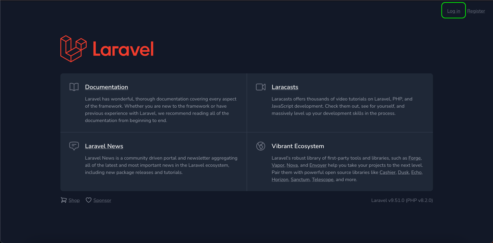

## About Laravel 

How to setup this project:

Please, clone this repo,run the migrations with

``composer install``

``npm run build``

``php artisan migrate``

You will need to have installed a **PHP 8.2** version to make this works.

This project was made with laravel and jet stream.

## Live demo

you can visit the website to fully test this project on:

https://crud-users-url.herokuapp.com/

Everything its working on this project, like:

1. **Forgot password** functionality, this will email you to your email address to confirm the reset of password.
2. User CRUD.
3. Two-factor authentication.
4. Login an register routes.

## How to login
You can find in the top-right of the screen the link to go to the login page

As well the register link.
